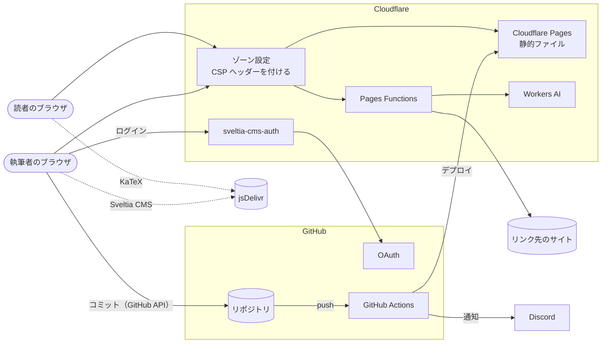
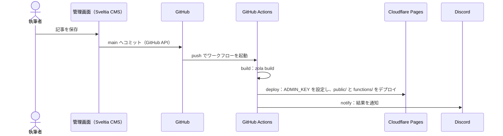

# blog.etak64n.dev のアーキテクチャ

blog.etak64n.dev は、Markdown で書いた記事を静的な HTML に変換して配信する技術ブログである。
記事とサイトのソースは GitHub のリポジトリ etak64n/blog.etak64n.dev に置かれ、main ブランチに入った変更が自動でビルドされて公開される。
記事はブラウザの管理画面で編集し、管理画面は編集内容をリポジトリへコミットする。

## 構成要素

システムは次の要素で構成される。

- **Zola**：Markdown の記事とテンプレートから HTML を生成する静的サイトジェネレーター。
  バージョンは 0.22.1 に固定している。
- **Cloudflare Pages**：Zola が生成した HTML、CSS、画像を配信するホスティングサービス。
  プロジェクト名は `etak64n-blog`。
- **Pages Functions**：Cloudflare Pages のプロジェクトに含まれ、リクエストのたびに実行される TypeScript の関数。
  Cloudflare Workers のランタイムで動く。
- **Workers AI**：Cloudflare の推論サービス。
  Pages Functions から呼び出し、記事の冒頭に置く見出し画像（ヒーロー画像）の生成に使う。
- **Sveltia CMS**：ブラウザで動く Git ベースのコンテンツ管理システム。
  編集内容を GitHub の API でリポジトリへコミットする。
  このブログの管理画面（`/admin/`）は、Sveltia CMS で動いている。
- **sveltia-cms-auth**：Sveltia CMS の GitHub ログインを中継する Cloudflare Worker。
  このリポジトリの外で管理している。
- **GitHub Actions**：リポジトリへの push と PR をきっかけに、ビルドとデプロイを実行する CI サービス。
- **ゾーン設定**：Cloudflare がドメイン etak64n.dev に対して持つ設定。
  応答のヘッダーを書き換える Transform Rule で、**Content-Security-Policy**（CSP）ヘッダーを付ける。
  CSP は、ページが読み込んでよいスクリプト、スタイル、画像、フレーム、接続先の出どころを、ブラウザに指示する HTTP ヘッダーである。
  ゾーン設定は、このリポジトリの外で管理している。
- **jsDelivr**：npm のパッケージを配信する CDN。
  Sveltia CMS の本体、数式を描く KaTeX、管理画面のプレビューでコードに色を付ける highlight.js を、ここから読み込む。
- **Discord**：デプロイの結果を受け取る通知先。

要素のあいだのやり取りは次のとおりである。



## 記事が公開されるまで

管理画面で記事を保存すると、Sveltia CMS は変更を GitHub の API で main ブランチへ直接コミットする。
記事に貼った画像とヒーロー画像も、同じコミットに入る。
main への push は GitHub Actions のワークフロー（`.github/workflows/deploy.yml`）を起動し、ワークフローは次の 3 つのジョブを順に実行する。

- **build**：Zola 0.22.1 でサイトをビルドし、出力先の `public/` を成果物として保存する。
  記事の先頭に書くメタデータ（front matter）で `draft = true` とした下書きは出力しない。
- **deploy**：管理画面から呼ぶ Pages Functions を守る共有鍵 `ADMIN_KEY` を、Cloudflare Pages の secret に書き込む。
  続いて、`public/` を `functions/` と一緒に、Cloudflare の CLI である wrangler で Cloudflare Pages へデプロイする。
- **notify**：build と deploy の結果を Discord に通知する。



PR でも build と deploy が走る。
PR のデプロイはプレビューとして扱われ、デプロイごとの URL（`<ハッシュ>.etak64n-blog.pages.dev`）と、最新の PR を指す `head.etak64n-blog.pages.dev` に出る。
本番の blog.etak64n.dev は、main へのマージで更新される。
`ADMIN_KEY` の書き込みは、main への push のときだけ行う。

## サイトの生成

Zola は、リポジトリの次のディレクトリを入力にして、`public/` に HTML を出力する。

- **content/**：記事の Markdown。
  記事ごとに、URL に使う名前（スラッグ）のフォルダを `content/articles/` の下に作り、本文の `index.md` と記事で使う画像を置く。
- **templates/**：HTML のテンプレート。
  テンプレートエンジンは Tera で、共通レイアウト、トップページ、記事一覧、記事ページ、タグのページを描く。
- **sass/**：スタイルシート。
  `sass/main.scss` が `main.css` になる。
- **static/**：加工せずに配信するファイル。
  管理画面（`static/admin/`）とヒーロー画像（`static/images/hero/`）を含む。

記事の front matter は TOML で書き、次の項目を持つ。

| 項目 | 内容 |
|---|---|
| `title` | タイトル |
| `date` | 公開日 |
| `updated` | 更新日 |
| `draft` | `true` の記事はビルドの出力に含めない |
| `taxonomies.tags` | タグ。タグごとに一覧ページができる |
| `extra.hero` | ヒーロー画像のパス。記事ページの冒頭と、一覧のカードに出る |
| `extra.toc` | 記事ページに目次を出すかどうか |
| `extra.math` | 本文の数式を描くかどうか |
| `extra.author` | 著者名 |

Zola の記事は、本文の中からテンプレートを呼び出せる。
この呼び出しを**ショートコード**と呼び、`templates/shortcodes/` のテンプレートが呼び出しを HTML に置き換える。
このブログは次のショートコードを持つ。

| ショートコード | 出力 |
|---|---|
| `ref` | 文中に置く出典のピル。ホバーで出典のタイトルと引用文を出す |
| `note` | 補足、注意、警告の注記ボックス。中身は Markdown として描き、`ref`、`link`、`img` を入れられる |
| `code` | ファイル名のタブが付いたコード枠。中身は ``` のコードブロックで書く |
| `codebox` | `code` と同じ枠。中身はコードをそのまま書く。既存の記事のために残している |
| `img` | 記事フォルダの画像。幅の違う縮小画像を作り、`srcset` に並べる |
| `link` | リンク先のタイトル、説明、ファビコンを並べたリンクカード |

ビルドのときに、Zola は次の加工も行う。

- **コードの色付け**：コードブロックの色を、HTML の中に埋め込む。
  テーマは Nord で、`code` と `codebox` の中身も同じ処理を受ける。
- **画像の縮小**：`img` が使う縮小画像を、Zola の画像処理で作る。
  作った画像は `static/processed_images/` に置かれ、リポジトリに含めている。
- **CSS の URL**：`main.css` の URL に、ファイルの内容から計算したハッシュを付ける。
  CSS を変えると URL も変わるので、ブラウザは新しい CSS を読み込む。
- **サイトマップ**：`sitemap.xml` を出力する。

## 公開ページのスクリプト

公開ページは、ビルドされた HTML に加えて、ブラウザで次の処理を行う。
処理は `templates/base.html` と `templates/articles/single.html` の script 要素に直接書かれている。

- **テーマの切り替え**：ライトとダークを切り替える。
  選んだテーマはブラウザに保存し、選んでいない場合は OS の設定に従う。
- **メニュー**：狭い画面で、ヘッダーのメニューを開閉する。
- **コード枠**：普通のコードブロックを、`code` と同じ枠に包む。
  1 行目の `// filename: 名前` からファイル名のタブを作り、どの枠にもコピーボタンを付ける。
- **参照のパネル**：`ref` のパネルが、記事の幅に収まる位置に出るよう調整する。
- **URL のリンク化**：本文に書かれた URL の文字列をリンクにする。
- **ファビコンの読み込み表示**：リンクカードと参照のファビコンが届くまで、地球のアイコンを出す。
- **数式**：`extra.math` が `true` の記事でだけ KaTeX を読み込み、`$$ … $$`、`\( … \)`、`\[ … \]` で囲んだ数式を描く。
  6502 の記事が 16 進数を `$0000` と書くため、`$` 一つで囲む書き方は数式として扱わない。
- **目次**：記事ページの目次で、読んでいる位置の見出しを強調し、その見出しが見える位置まで目次をスクロールする。

## 提供していない機能

ブログとしてよくある機能のうち、次のものは提供していない。

| 機能 | 理由 |
|---|---|
| サイト内検索 | Zola の検索索引は、日本語の分かち書きに対応していない |
| RSS と Atom のフィード | Zola の設定（`generate_feeds = false`）で出力を止めている |
| コメント | 静的なサイトでコメントを受け付けるには、外部のサービスとの連携が要る |

## Pages Functions

`functions/` に置いた TypeScript のファイルは、ファイルのパスがそのまま URL のパスになる。
そのパスへのリクエストは関数が処理し、ほかのパスには静的ファイルが返る。
このサイトの関数は次の 3 つである。

| パス | 処理 | 呼び出し元 |
|---|---|---|
| `/favicon/<ホスト名>` | リンク先サイトのファビコンを取得し、同じオリジンの画像として返す | 公開ページ、管理画面のプレビュー |
| `/api/admin/hero` | 記事の内容からヒーロー画像を生成する（POST） | 管理画面 |
| `/api/admin/link-meta` | リンク先ページのタイトルと説明を返す（GET） | 管理画面 |

### ファビコンの取得

リンクカードと参照に出すファビコンは、リンク先のサイトがページの `<head>` で指定している。
ブラウザのスクリプトはほかのサイトの HTML を読めないため、指定を読んで画像を選ぶ処理はサーバー側に置いている。
`/favicon/<ホスト名>` は、リクエストのたびにリンク先サイトのトップページを取得し、`<head>` のアイコン指定から 48 px 前後の画像を選んで返す。
アイコン指定が使えないときは `/favicon.ico` を試し、それも取れなければ地球のアイコンを返す。

返す画像は、先頭のバイトで判定した PNG、ICO、GIF、JPEG、WebP に限る。
SVG を返さないのは、同じオリジンから配信した SVG は、直接開くとスクリプトを実行できるためである。
取得した画像はサーバーに保存せず、ブラウザに 1 日キャッシュさせる。
ほかのサイトのページからの要求（`Sec-Fetch-Site` が cross-site か same-site）は 403 で断る。

### 管理用 API の検査

`/api/admin/` 以下の関数には、その前に `functions/api/admin/_middleware.ts` の検査が入る。
検査は、要求が同じオリジンから来たことと、`Authorization` ヘッダーの Bearer トークンが `ADMIN_KEY` と一致することを確かめる。
トークンの比較は、比較にかかる時間から鍵を推測されないよう、定数時間で行う。
サーバーに `ADMIN_KEY` が設定されていないときは 503 を返す。

### ヒーロー画像の生成

`/api/admin/hero` は、記事のタイトル、タグ、本文の冒頭を受け取り、Workers AI で画像を生成する。
テキストモデル（Llama 3.3 70B）が、サイトの配色に合わせた英語の画像プロンプトを作る。
画像モデル（FLUX.1 schnell）が、そのプロンプトから 1024×1024 の画像を作る。
関数は画像をそのまま返し、使ったプロンプトを応答ヘッダーに入れる。
画像を 1200×630 に収めて WebP に変換する処理は、管理画面の側で行う。

### リンク先ページの読み取り

`/api/admin/link-meta` は、`url` に指定されたページを取得し、タイトルと説明を JSON で返す。
タイトルは `og:title`、`twitter:title`、`<title>` の順に探し、説明は `og:description`、`description`、`twitter:description` の順に探す。
文字コードは、応答ヘッダーかページ内の指定に従って解釈する。
IP アドレスやローカルの名前を指す URL は 400 で断り、ページを読めなかったときは 502 を返す。

### 関数の設定

関数の実行環境には、次の設定が渡る。

- **Workers AI のバインディング**：`wrangler.toml` の `[ai]` で `AI` という名前に結び付ける。
- **ADMIN_KEY**：Cloudflare Pages の secret。
  deploy ジョブが GitHub の Secrets から書き込む。
- **DEV_FAKE_AI**：ローカル開発でだけ使う変数。
  `true` のとき、`/api/admin/hero` は Workers AI を呼ばずに仮の SVG を返す。

## 管理画面

管理画面は `https://blog.etak64n.dev/admin/` にあり、`static/admin/` のファイルがそのまま配信される。
管理画面の処理はブラウザの中で動き、GitHub との通信もブラウザから直接行う。

`static/admin/index.html` は、Sveltia CMS 0.218.3 を jsDelivr から読み込む。
版を固定しているのは、ブログの拡張が使う JavaScript API が新しく、版を上げると挙動が変わりうるためである。
`index.html` は Sveltia CMS の自動起動を止め、`static/admin/cms.js` が拡張を登録してから起動する。

`static/admin/config.yml` は、Sveltia CMS の設定である。

- **バックエンド**：GitHub のリポジトリ etak64n/blog.etak64n.dev の main ブランチ。
  ログインは sveltia-cms-auth を経由する。
- **コレクション**：`content/articles/` 以下の記事。
  記事は `<スラッグ>/index.md` に TOML の front matter で保存し、画像は `index.md` と同じフォルダに保存する。
- **フィールド**：front matter の各項目と本文に対応する入力欄。

Sveltia CMS は、GitHub へのコミット、ログイン、画像の管理を受け持つ。
ブログ固有の機能は、Sveltia CMS の JavaScript API で次の拡張として足している。

- **プレビュー**：記事ページと同じ HTML の構造で記事を描き、サイトの `main.css` を読み込む。
  ショートコードは JavaScript で HTML に変換し、コードは highlight.js（Nord）、数式は KaTeX で描く。
- **本文エディタ**：本文の入力欄を置き換える部品。
  ショートコードをボタンと ⌘/ の一覧から挿入し、各欄に例の値を入れ、Tab で欄を移る。
  リンクカードと参照のタイトルは、`/api/admin/link-meta` で取得して埋める。
- **ヒーロー画像の欄**：`/api/admin/hero` で画像を生成し、1200×630 の WebP にして、記事と同じコミットに入れる。
- **挿入フォーム**：本文の欄を Sveltia CMS 標準の Markdown エディタに戻したときに使う、ショートコードの入力フォーム。

管理画面は、ヒーロー画像の欄で一度入力した `ADMIN_KEY` を、ブラウザの localStorage に保存する。
`/api/admin/` への要求には、保存した鍵を Bearer トークンとして付ける。
拡張の詳細は `docs/cms-extensions.md` にある。

## GitHub へのログイン

管理画面は、GitHub の OAuth でログインする。
OAuth のトークンの発行には、OAuth App のクライアントシークレットが必要である。
ブラウザに渡した値はページを開いた人なら誰でも読めるため、シークレットはサーバー側に置く必要がある。
そのため、トークンの発行は Cloudflare Worker の sveltia-cms-auth が中継する。

sveltia-cms-auth は、GitHub の OAuth App の値（`GITHUB_CLIENT_ID`、`GITHUB_CLIENT_SECRET`）を環境変数に持つ。
`ALLOWED_DOMAINS` により、blog.etak64n.dev の管理画面からの要求だけを受け付ける。
ログインが済むと、ブラウザが GitHub のトークンを持ち、GitHub の API を直接呼ぶ。
コミットの作者は、ログインした GitHub のユーザーになる。

## Content-Security-Policy

このサイトの CSP は、Cloudflare のゾーン設定にある Transform Rule が応答に付ける。
ゾーン etak64n.dev にはブログのほかにも多くのアプリがあり、規則は、全ホストに共通の規則とホストごとの規則を順に適用する形になっている。
同じヘッダーを複数の規則が設定したときは、後から適用した規則の値が残る。

ブログに関わる規則は次の 3 本で、この順に適用される。

- **既定の規則**：全ホストに CSP、Permissions-Policy、Referrer-Policy、HSTS、X-Content-Type-Options、X-Frame-Options を付ける。
  ほかのアプリと共有しているので、ブログの都合では変えない。
- **公開ページの規則**：blog.etak64n.dev の CSP と Permissions-Policy を、ブログ用の値に置き換える。
- **管理画面の規則**：blog.etak64n.dev の `/admin/` の CSP を、Sveltia CMS 用の値に置き換える。

公開ページの CSP は、読み込み元を次のように許可する。

- **スクリプト**：同じオリジン、インラインのスクリプト、KaTeX を置く jsDelivr、Cloudflare のアクセス解析のスクリプト。
  アクセス解析のスクリプトは Cloudflare が配信時にページへ差し込み、計測結果を同じオリジンの `/cdn-cgi/rum` へ送る。
- **スタイル**：同じオリジン、インラインのスタイル、jsDelivr。
- **フォント**：同じオリジンと jsDelivr。
- **画像**：同じオリジン、data: URL、https で配信されるすべての画像。
  記事は、どのサイトの画像でも表示できる。
- **動画と音声**：同じオリジンと、https で配信されるすべての動画と音声。
- **接続先**：同じオリジンだけ。
- **フレーム**：ほかのサイトがこのサイトをフレームに埋め込むことを禁じる。

管理画面の CSP は、画像と動画について公開ページと同じ出どころを許可するので、プレビューにも同じ画像が出る。
そのうえで、GitHub の API との通信と、Sveltia CMS が作る blob: URL を許可する。
管理画面の作りの一部は、この CSP に合わせたものである。

- **import map**：Sveltia CMS は、一部のモジュールを unpkg.com から読み込む。
  unpkg.com はスクリプトの読み込み元に含まれないため、`static/admin/index.html` の import map が unpkg.com の URL を jsDelivr の同じパッケージに読み替える。
- **プレビューの iframe**：Sveltia CMS は、プレビューの iframe を blob: URL で作る。
  blob: URL はフレームの読み込み元に含まれないため、`static/admin/csp-compat.js` が blob: URL の代わりに `srcdoc` で iframe に中身を渡す。

ゾーンの規則が効くのは、etak64n.dev の名前で届いた要求だけである。
Cloudflare Pages が割り当てる `etak64n-blog.pages.dev` への要求には、ゾーンの規則のヘッダーが付かない。
そのため、アカウントの一括転送（Bulk Redirects）で、`etak64n-blog.pages.dev` への要求を blog.etak64n.dev へ 301 で転送している。
PR のプレビューが出るサブドメインは転送の対象外で、ゾーンの規則のヘッダーが付かないまま表示される。

公開ページの規則、管理画面の規則の画像と動画の許可、一括転送は、`scripts/cloudflare-edge.mjs` が設定する。
スクリプトは既定では現在の設定との差分を表示するだけで、`--apply` を付けたときに設定を変え、読み直して差分が残っていないことを確かめる。
既定の規則とほかのアプリの規則には触れない。

```bash
node --env-file=<CLOUDFLARE_* を書いたファイル> scripts/cloudflare-edge.mjs           # 差分の表示
node --env-file=<CLOUDFLARE_* を書いたファイル> scripts/cloudflare-edge.mjs --apply   # 反映
```

CSP による読み込みの拒否は、ポリシーが付く本番でだけ起きる。
ローカルの管理画面サーバーは、本番の CSP ヘッダーを取得して同じポリシーを付けるので、この種の不具合を手元で再現できる。

## 秘密情報

秘密情報は次の場所に置いている。

| 名前 | 置き場所 | 使う側 |
|---|---|---|
| `CLOUDFLARE_API_TOKEN` | GitHub の Secrets | deploy ジョブ（wrangler） |
| `CLOUDFLARE_ACCOUNT_ID` | GitHub の Secrets | deploy ジョブ（wrangler） |
| `DISCORD_WEBHOOK_URL` | GitHub の Secrets | notify ジョブ |
| `ADMIN_KEY` | GitHub の Secrets、Cloudflare Pages の secret、執筆者のブラウザ | `/api/admin/` の検査、管理画面 |
| `GITHUB_CLIENT_ID` | sveltia-cms-auth の環境変数 | GitHub ログインの中継 |
| `GITHUB_CLIENT_SECRET` | sveltia-cms-auth の環境変数 | GitHub ログインの中継 |
| Cloudflare の API トークン、または Global API Key | 手元の環境ファイル（リポジトリの外） | `scripts/cloudflare-edge.mjs` |

`ADMIN_KEY` を替えるときは、GitHub の Secrets を更新して main に push する。
deploy ジョブが、新しい値を Cloudflare Pages の secret に書き込む。

```bash
gh secret set ADMIN_KEY -R etak64n/blog.etak64n.dev
```

ローカル開発で使う値は `.dev.vars` に書く。
`.dev.vars` は Git の管理から外している。

## ローカルでの確認

管理画面と Pages Functions は、次のコマンドで手元に立ち上がる。

```bash
cp .dev.vars.example .dev.vars   # ADMIN_KEY と DEV_FAKE_AI=true
npm run admin                    # http://127.0.0.1:8788
open "http://127.0.0.1:8788/admin/?backend=test"
```

`npm run admin`（`scripts/admin-dev.sh`）は、次の手順でサーバーを立ち上げる。

1. サイトを一時ディレクトリにビルドする。
2. 本番の CSP ヘッダーを取得し、管理画面と公開ページに同じポリシーを付ける `_headers` を書く。
3. Workers AI のバインディングを外した設定で、wrangler の開発サーバーを起動する。
   Workers AI のバインディングがあると、wrangler は Cloudflare へのログインを求めるためである。

`?backend=test` を付けると、Sveltia CMS はテスト用のバックエンドで動き、記事をブラウザの中に保存する。
GitHub へのログインは要らず、リポジトリにも書き込まない。

サイトの見た目だけを確かめるときは、`npm run dev`（`zola serve`）で足りる。
Pages Functions の型検査は `npm run typecheck` で行う。

`zola build` は、使われていない縮小画像を `static/processed_images/` から削除する。
リポジトリには今の記事で使っていない縮小画像も含まれているので、ローカルでビルドしたあとは次のコマンドで元に戻す。

```bash
git checkout -- static/processed_images
```

## リポジトリの構成

```
content/articles/<スラッグ>/index.md  記事（画像は同じフォルダ）
templates/
  base.html                            共通レイアウトと、公開ページのスクリプト
  index.html                           トップページ（新着 10 件）
  articles/list.html                   記事一覧（20 件ごと）
  articles/single.html                 記事ページ（目次、関連記事）
  taxonomy_list.html                   タグの一覧
  taxonomy_single.html                 タグごとの記事一覧
  shortcodes/                          ショートコード
  partials/codebox.html                code と codebox の共通の枠
sass/main.scss                         サイトのスタイルシート
static/
  admin/                               管理画面（Sveltia CMS の設定と拡張）
  images/hero/                         ヒーロー画像
  processed_images/                    img の縮小画像
functions/
  api/admin/_middleware.ts             管理用 API の検査
  api/admin/hero.ts                    ヒーロー画像の生成
  api/admin/link-meta.ts               リンク先ページの読み取り
  favicon/[host].ts                    ファビコンの取得
  lib/                                 関数の共通処理
scripts/admin-dev.sh                   ローカルの管理画面サーバー
scripts/cloudflare-edge.mjs            Cloudflare のブログ用の規則と一括転送の設定
.github/workflows/deploy.yml           build、deploy、notify のワークフロー
wrangler.toml                          Pages のプロジェクト名と Workers AI のバインディング
config.toml                            Zola の設定
docs/                                  ドキュメント
```
