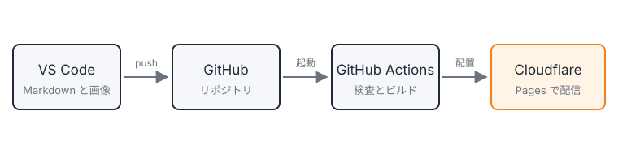

## はじめに

この記事は、Astro と Cloudflare Pages で構築したこのブログの、投稿の流れを確かめるためのテスト記事です。
記事の先頭の画像は、Workers AI で生成しました。

## 構成

このブログは次の要素で成り立っています。

- **Astro** — 静的サイトジェネレーター。Markdown の記事から HTML を生成します。
- **VS Code** — 記事を書くエディター。記事ごとのフォルダーに、Markdown と画像を置きます。
- **GitHub** — 記事の保存先。push を受けて、GitHub Actions が検査とビルドを行います。
- **Cloudflare Pages** — ホスティング。`main` ブランチへの push で自動的にデプロイされます。
- **Workers AI** — 記事の先頭の画像（ヒーロー画像）を生成します。


投稿の流れ

## 投稿の流れ

1. `npm run new` で記事のフォルダーとファイルを作る
2. VS Code で本文を書き、スクリーンショットを貼り付ける
3. `npm run hero` でヒーロー画像を作る
4. フロントマターの `draft` を `false` にして、`main` に push する
5. 数分で本番に反映される

```bash
npm run new -- hello-astro
npm run hero -- hello-astro
git add src/content/blog/hello-astro
git commit -m "Add a test post"
git push
```

> [!NOTE]
> この記事が本番サイトに表示されていれば、投稿の流れは正常に動作しています。

## おわりに

記事の書き方は、リポジトリの [CONTRIBUTING.md](https://github.com/etak64n/blog.etak64n.dev/blob/main/CONTRIBUTING.md) にまとめています。
