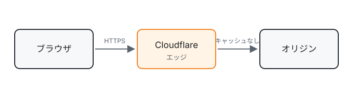

この記事は下書きのまま置いておく見本です。`npm run dev` とプルリクエストのプレビューにだけ表示され、本番には公開されません。記法の書き方は [CONTRIBUTING.md](https://github.com/etak64n/blog.etak64n.dev/blob/main/CONTRIBUTING.md) にまとめています。
記事の先頭と一覧のカードの画像は、フロントマターの `hero` で指定しています。

## 段落と改行

段落は空行で区切ります。
段落の中の改行は、そのまま改行として表示されます。
この 3 行は 1 つの段落です。

## 文字の装飾

**太字**、*斜体*、~~取り消し線~~、`インラインコード`、<kbd>⌘</kbd> + <kbd>V</kbd> のキー表記が使えます。リンクは [Cloudflare Docs](https://developers.cloudflare.com/) のように書き、URL をそのまま書いても https://developers.cloudflare.com/workers/ のようにリンクになります。

本文の補足は脚注にできます[^footnote]。

[^footnote]: 脚注は記事の末尾にまとめて表示されます。

## 見出し

本文の見出しは `##`（h2）から始めます。`#`（h1）は記事タイトルに使われるため、本文では使いません。h2 から h4 までが、左の目次に載ります。

### 小見出し

h3 の見出しです。

#### さらに小さい見出し

h4 の見出しです。

## リスト

- 箇条書き
- 箇条書き
  - 入れ子の箇条書き

1. 番号付きリスト
2. 番号付きリスト

- [x] 完了したタスク
- [ ] 未完了のタスク

## コードブロック

言語名を書くと色が付きます。`title="ファイル名"` でファイル名のタブが付きます。

```ts title="src/index.ts"
export default {
  async fetch(request: Request): Promise<Response> {
    const url = new URL(request.url);
    return new Response(`Hello from ${url.pathname}`);
  },
} satisfies ExportedHandler;
```

`bash` や `sh` などのシェルの言語はターミナルの枠で表示されます。コピーボタンは `#` で始まるコメント行を除いてコピーします。

```bash
# Cloudflare にデプロイする
npx wrangler deploy
```

行番号は `showLineNumbers`、強調する行は `{行番号}`、追加・削除した行は `ins={}` と `del={}` で指定します。

```jsonc title="wrangler.jsonc" showLineNumbers ins={4} del={3}
{
  "name": "my-worker",
  "main": "src/index.js",
  "main": "src/index.ts",
  "compatibility_date": "2026-10-01"
}
```

```diff
- const timeout = 10;
+ const timeout = 30;
```

## 表

| 項目 | 左寄せ | 右寄せ | 中央 |
| ---- | :----- | -----: | :--: |
| CPU  | 1 vCPU |    128 |  ○   |
| メモリ | 128 MB |  1,024 |  ×   |

## 画像

記事のフォルダーに置いた画像を相対パスで貼ります。画像の次の行に書いた文が、画像の説明（キャプション）になります。


ビルド時に WebP へ変換され、幅に合わせた 2 種類の大きさが作られます


リクエストの流れ（筆者作成）

## 注記

> [!NOTE]
> 補足の情報です。

> [!TIP]
> 知っておくと便利なことです。

> [!IMPORTANT]
> 読み飛ばしてほしくない重要な情報です。

> [!WARNING]
> 注意が必要なことです。

> [!CAUTION]
> 危険を伴う操作や、取り返しのつかない結果になることです。

## 引用

引用文を `>` で書き、最後の段落を `出典:` で始めると、出典付きの引用として表示されます。

> Cloudflare Workers gives developers the power to deploy serverless code instantly to Cloudflare's global network.
>
> 出典: [Cloudflare Workers（Cloudflare Docs）](https://developers.cloudflare.com/learning-paths/workers/concepts/workers-concepts/)

出典の行がない `>` は、通常の引用ブロックです。

> 出典のない引用ブロックです。

## 折りたたみ

<details>
<summary>クリックで開く</summary>

折りたたまれた内容です。中にも Markdown を書けます。

</details>

## 参考資料

- [Markdown in Astro](https://docs.astro.build/en/guides/markdown-content/)
- [Expressive Code](https://expressive-code.com/)
